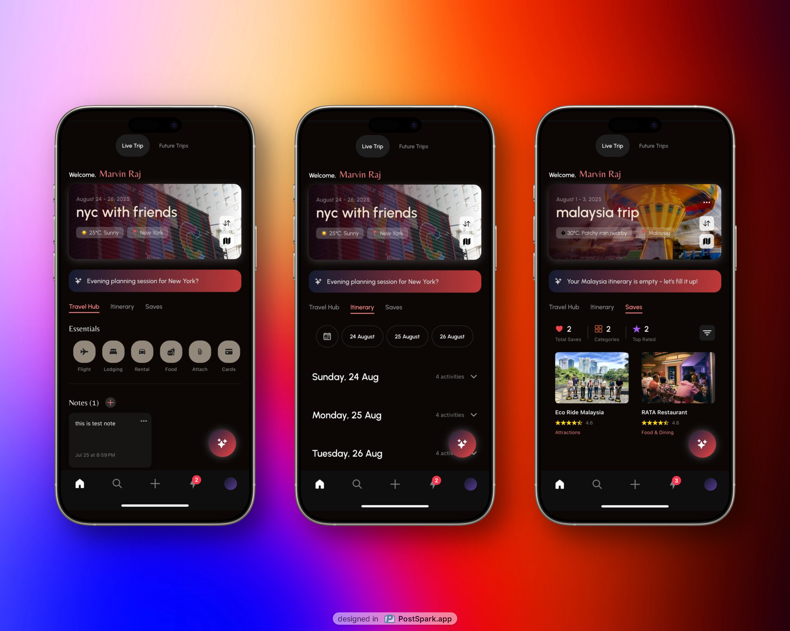
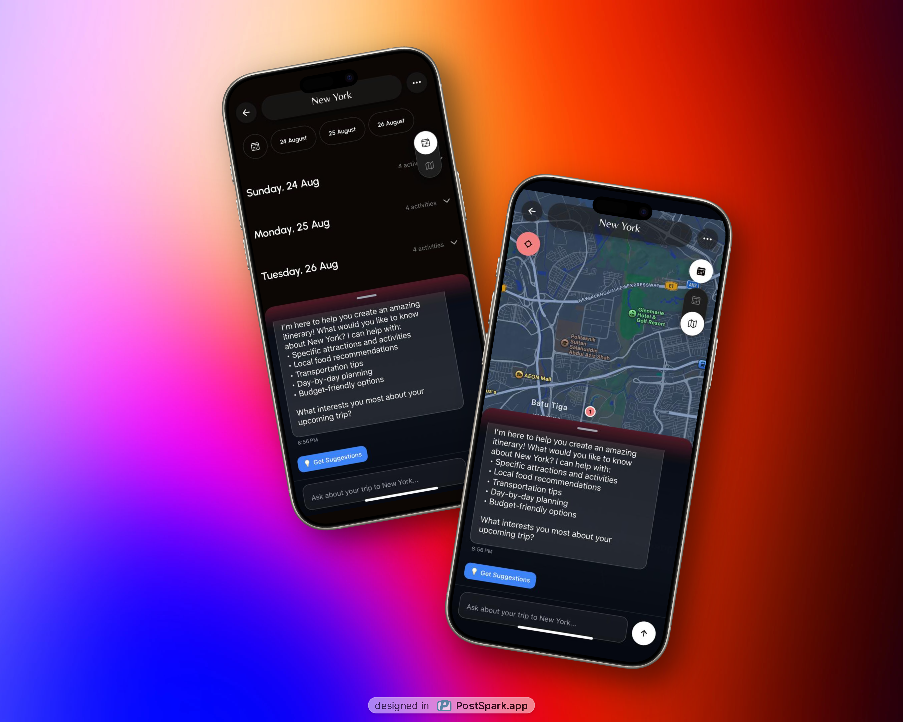

# TRAVA - AI-Powered Travel Assistant

A comprehensive AI-powered travel planning and assistance mobile application built with React Native, Expo, Supabase and powered by Google Gemini Pro AI. This project was built for PRJ3223 Capstone Project 2.

  

  

  

## About This Project

TRAVA (AI-Powered Travel Assistant) is a smart travel assistant that helps users plan, organize, and manage their trips with the power of artificial intelligence. The app provides personalized travel recommendations, intelligent itinerary planning, real-time place discovery, and contextual travel advice tailored to each user's specific trip details and preferences.

### Key Features:
- **AI-Powered Travel Assistant**: Chat with an intelligent travel expert that understands your trip context
- **Smart Trip Planning**: Create and manage detailed itineraries with AI assistance
- **Place Discovery**: Find and save places with Google Places integration
- **Real-time Notifications**: Stay updated with trip reminders and travel alerts
- **Cross-platform**: Built with React Native for both iOS and Android

## 🛠️ **Tech Stack**

### **Frontend**
- **React Native** `0.79.5` - Cross-platform mobile development
- **Expo** `53.0.20` - Development platform and toolchain
- **TypeScript** `5.8.3` - Type-safe JavaScript
- **Expo Router** `5.1.4` - File-based navigation
- **NativeWind** `4.1.23` - Tailwind CSS for React Native
- **React Native Reanimated** `3.17.4` - Smooth animations

### **AI & Backend**
- **Google Generative AI** `0.24.1` - Gemini Pro integration
- **Supabase** `2.39.7` - Backend-as-a-Service
- **PostgreSQL** - Relational database (via Supabase)
- **Real-time subscriptions** - Live data sync

### **Maps & Location**
- **React Native Maps** `1.20.1` - Interactive maps
- **Expo Location** `18.1.6` - GPS and location services
- **Expo Notifications** `0.31.4` - Push notifications

### **UI & UX**
- **Expo Vector Icons** `14.1.0` - Icon library
- **React Native Calendars** `1.1260.0` - Date selection
- **React Native Linear Gradient** `2.8.3` - Beautiful gradients
- **React Native Markdown Display** `7.0.2` - Rich text rendering

---

## 📄 **License**

This project is licensed under the MIT License - see the [LICENSE](LICENSE) file for details.

